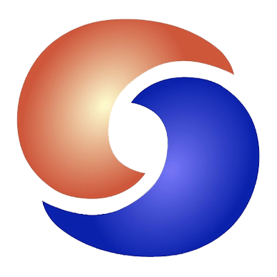
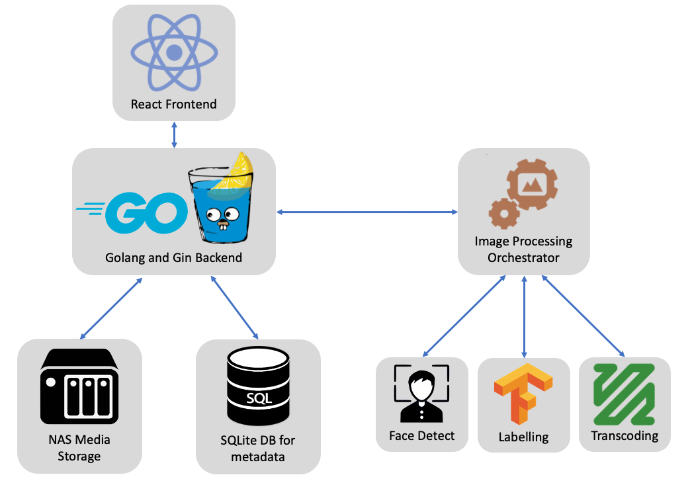

[][goreport]

# Tidepod
A self hosted photo management platform that supports automatic face recognition and object detection. Built with Go

## Motivation
Google recently [announced](https://blog.google/products/photos/storage-changes) that it will begin charging for its popular cloud photo management application, [Google Photos](https://www.google.com/photos/about/).

I've been using Photos as my personal backup tool since its release in 2015. I'm a big fan of its organizational features, which allow me to group by people (using facial recognition) and the semantics within images. The tool allows me to quickly search for what I'm looking for, as Photos runs a host of algorithms to intelligently index the photos as soon as they are uploaded.

After building my Network Array Storage Server while staying at home during quarantine, I decided to start Tidepod, a self-hosted photo management platform written. Out of the box computer vision libraries have become advanced over the past few years, and I would love to be able to recreate some of my favorite features from Photos, and add my own custom set of features. 

## :white_check_mark: Completed Goals
- Be able to upload/download photos using the web interface
- Face detection and **recognition** (using [go-face](https://github.com/Kagami/go-face))
- Label photos automatically based on semantics (using [tensorflow](https://www.tensorflow.org/))
- **Parallelize** the above workflows that run on all uploaded images
- Automatic **fast** duplicate photo detection on upload using metadata

## :steam_locomotive: Current Goals
- Smart Search with a quick index
- Mobile application to upload photos to server

## Architecture

I expect to see lots of opportunities for concurrency in Tidepod. For example, running Tensor Flow's suite of classification algorithms for labelling just sounds like an [embarrassingly parallel](https://en.wikipedia.org/wiki/Embarrassingly_parallel) use case. This is exactly why I chose to write Tidepod in Go!

- Web Framework: [Gin](https://github.com/gin-gonic/gin) a framwork optimized for performance
- ORM: [GORM](https://gorm.io/index.html)
- Front end: [React](https://reactjs.org/) because who doesn't enjoy a fine looking site?

[goreport]: https://goreportcard.com/report/github.com/anish-krishnan/tidepod
